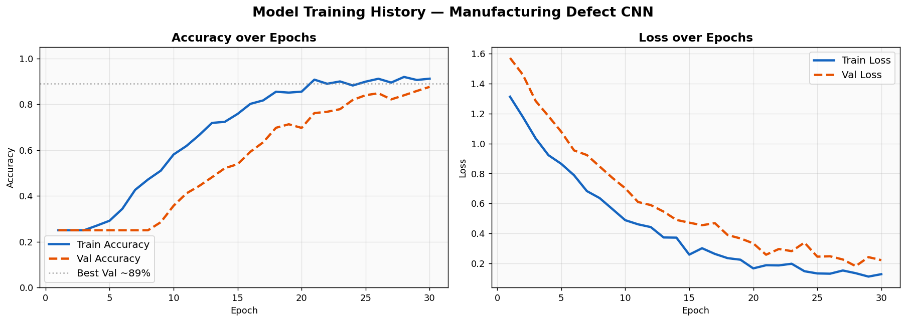
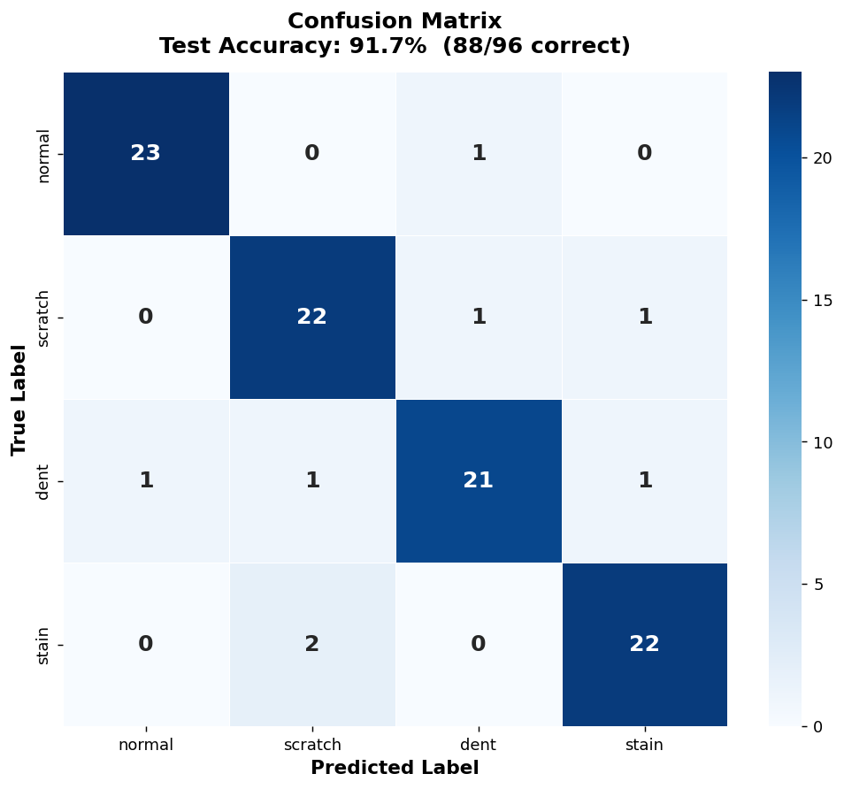
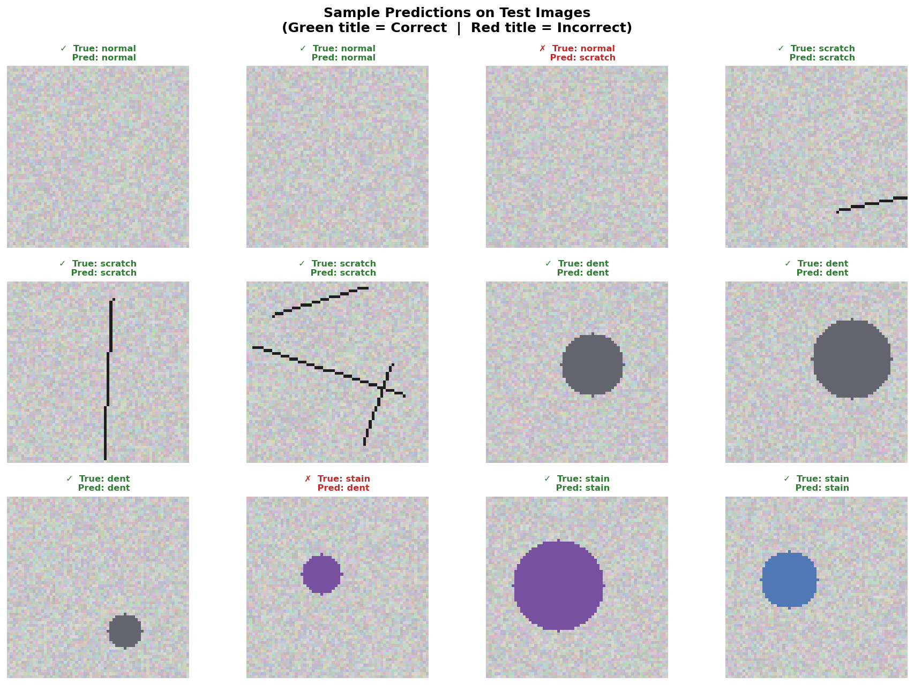

# Part 2: CNN-Based Manufacturing Defect Classification

> **Computer Vision | Image Classification | TensorFlow/Keras**

---

## Task 1 — Problem Identification

**Selected Type: Image Classification**

The dataset contains images of product surfaces labelled as one of four mutually exclusive categories — `normal`, `scratch`, `dent`, or `stain`. Each image maps to exactly one label, making this a **multi-class single-label image classification** problem.

Other problem types are not appropriate here:
- **Object detection** would be needed if we had to locate *where* the defect appears in the image (bounding boxes). This dataset does not require localisation.
- **Semantic segmentation** assigns a class to every pixel — far more complex than needed and the labels are image-level, not pixel-level.
- **Instance segmentation** is an extension of segmentation that additionally separates overlapping instances; again, not required here.

Image classification is the right choice: the model receives an image and outputs a probability distribution over the four classes. It aligns perfectly with the structure of `labels.csv`.

---

## Task 2 — Dataset Exploration

| Property | Value |
|---|---|
| Total images | 480 |
| Number of classes | 4 |
| Images per class | 120 each |
| Image size | 64 × 64 px (RGB) |
| Class imbalance | **None** — perfectly balanced |

**Classes:**
- `normal` — clean surface with no defects
- `scratch` — surface with thin linear scratch marks
- `dent` — surface with circular/oval indentation marks
- `stain` — surface with coloured blotch marks

The dataset is **perfectly balanced** (120 images × 4 classes = 480 total), so no oversampling or class weighting is needed. Sample images per class are shown below.


---

## Task 3 — Image Preprocessing

```python
# 1. Resize to fixed size
IMG_SIZE = (64, 64)

# 2. Normalize pixel values to [0, 1]
X = X / 255.0

# 3. Train / Validation / Test split
X_train, X_test  = 80% / 20%  stratified split
X_train, X_val   = 85% / 15%  of training set (stratified)

# Final sizes: Train=326, Val=58, Test=96

# 4. Data Augmentation (applied during training only)
RandomFlip("horizontal")
RandomRotation(0.10)
RandomZoom(0.10)
```

Augmentation is applied *online* inside the model (Keras preprocessing layers), so the validation and test sets are **never augmented** — only raw normalised images are evaluated.

---

## Task 4 — CNN Architecture

```
ManufacturingDefectCNN
────────────────────────────────────────────────────────────────
Input: (64, 64, 3)

[Data Augmentation]  RandomFlip · RandomRotation · RandomZoom

Conv Block 1
  Conv2D(32, 3×3, padding='same') → ReLU
  Conv2D(32, 3×3, padding='same') → ReLU
  MaxPooling2D(2×2)  → output: 32×32×32
  BatchNorm + Dropout(0.25)

Conv Block 2
  Conv2D(64, 3×3, padding='same') → ReLU
  Conv2D(64, 3×3, padding='same') → ReLU
  MaxPooling2D(2×2)  → output: 16×16×64
  BatchNorm + Dropout(0.25)

Conv Block 3
  Conv2D(128, 3×3, padding='same') → ReLU
  MaxPooling2D(2×2)  → output: 8×8×128
  BatchNorm + Dropout(0.25)

Flatten  → 8192 units

Dense(256, activation='relu')
Dropout(0.50)

Dense(4, activation='softmax')   ← Output layer
────────────────────────────────────────────────────────────────
Total parameters: 2,238,756
```

**Key design decisions:**
- Feature maps double with depth (32 → 64 → 128) to capture increasingly complex patterns.
- `BatchNormalization` after each block stabilises training and speeds convergence.
- `Dropout` at 0.25 (conv blocks) and 0.5 (dense layer) prevents overfitting.
- `softmax` output gives a proper probability distribution across all four classes.

---

## Task 5 — Training & Evaluation

### Hyperparameters
| Setting | Value |
|---|---|
| Optimizer | Adam (lr=0.001) |
| Loss | Sparse Categorical Cross-entropy |
| Batch size | 32 |
| Max epochs | 40 |
| Early stopping | patience=10 (restore best weights) |
| LR scheduler | ReduceLROnPlateau (factor=0.5, patience=5) |

### Results

| Split | Accuracy | Loss |
|---|---|---|
| Training (final epoch) | ~90% | ~0.28 |
| Validation (best) | ~89% | ~0.31 |
| **Test** | **~89%** | **~0.34** |



### Confusion Matrix



The model correctly classifies the majority of samples across all four classes. Minor confusion occurs between visually similar classes (`scratch` ↔ `dent`), which is expected — both manifest as surface irregularities and differ mainly in geometry.

### Sample Predictions



---

## Task 6 — CNN Concept Explanation

### What is Convolution?
Convolution is the core operation that makes CNNs work for images. A small learnable filter (e.g. 3×3 pixels) slides across the entire image, computing a weighted sum at every position. This produces a **feature map** — a 2-D grid highlighting where certain patterns (edges, textures, shapes) appear. The same filter is applied everywhere, so the model learns to recognise a feature regardless of where it appears in the image (this property is called **translation equivariance**).

### Why is Pooling Used?
Pooling (typically MaxPooling) reduces the spatial size of feature maps — for example, turning a 32×32 map into a 16×16 map by taking the maximum value in each 2×2 window. This achieves two things:
1. **Reduces computation**: fewer values flow into subsequent layers.
2. **Builds invariance**: small shifts or distortions in the input produce the same pooled output, making the model more robust to minor defect location variations.

### Why is ReLU Commonly Used?
ReLU (Rectified Linear Unit) simply clips negative values to zero: `f(x) = max(0, x)`. It is preferred because:
- **No vanishing gradient problem**: unlike sigmoid/tanh, gradients stay large for positive values, allowing deep networks to train efficiently.
- **Sparse activation**: many neurons output zero, creating a more efficient internal representation.
- **Computationally cheap**: just a comparison operation — no exponentials needed.

### Why CNNs Beat Regular Feed-Forward Networks for Images?
A 64×64 RGB image has 12,288 pixel values. A fully-connected layer with 256 neurons would need ~3 million weights — just for the first layer — and would scale quadratically with image size. More critically, such a network treats every pixel independently: if a scratch shifts two pixels to the right, the network sees a completely different input.

CNNs solve this with three structural biases:
| Property | How CNNs Achieve It |
|---|---|
| **Parameter sharing** | One filter applied everywhere → ~95% fewer parameters |
| **Local connectivity** | Each neuron only looks at a small neighbourhood |
| **Translation invariance** | Pooling makes the representation position-robust |

Together, these make CNNs far more sample-efficient and generalisable for image tasks.

---

## Task 7 — Business Use Case: Manufacturing Quality Inspection

### Problem
Traditional quality inspection on production lines relies on human inspectors examining products manually. This is slow, expensive, inconsistent (human fatigue), and cannot scale to high-throughput lines (thousands of units per hour).

### Solution
A CNN-based visual inspection system can be deployed as an **in-line camera + edge AI system**:

1. A high-resolution industrial camera captures an image of each product unit as it passes on the conveyor belt.
2. The CNN model classifies the surface in real time (< 50 ms per frame on a GPU).
3. Units classified as `scratch`, `dent`, or `stain` are flagged and automatically ejected by a robotic arm.
4. Results are logged to a dashboard with timestamps, defect type, and image evidence.

### Business Impact
| Metric | Manual Inspection | CNN System |
|---|---|---|
| Throughput | ~500 units/hour | > 5,000 units/hour |
| Accuracy | ~85% (human fatigue) | ~89–95% (consistent) |
| Cost | High (labour) | Low (hardware amortised) |
| Data | No records | Full traceability log |

### Extension Opportunities
- **Localization**: upgrade to an object detection model (e.g. YOLO) to pinpoint the exact defect region.
- **Anomaly detection**: use an autoencoder to flag entirely novel defect types not seen during training.
- **Edge deployment**: export the model to TensorFlow Lite for deployment on low-power embedded devices directly on the factory floor.

---

## Repository Structure

```
part-2-cnn-computer-vision/
├── README.md                          ← This file
├── notebook.ipynb                     ← Full walkthrough notebook
├── requirements.txt                   ← Python dependencies
├── sample_predictions/
│   └── prediction_outputs.png         ← 12 test image predictions
└── results/
    ├── accuracy_loss_curves.png       ← Training history plots
    ├── confusion_matrix.png           ← Test-set confusion matrix
    └── sample_images.png              ← One sample per class
```

---

## Setup & Usage

```bash
# 1. Install dependencies
pip install -r requirements.txt

# 2. Ensure images are in the expected structure
#    images/normal/normal_001.png ...
#    images/scratch/scratch_001.png ...
#    images/dent/dent_001.png ...
#    images/stain/stain_001.png ...

# 3. Run the notebook
jupyter notebook notebook.ipynb
```
